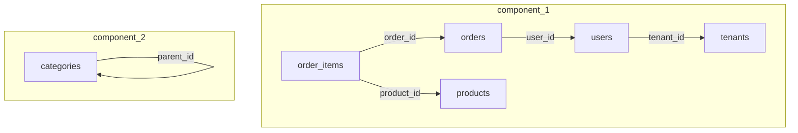

# db-sub-data

PostgreSQL データベースから FK 依存関係を保ったままデータのサブセットを抽出する CLI ツール。

## インストール

```bash
go install github.com/sfunasaka/db-sub-data@latest
```

またはソースからビルド:

```bash
go build -o db-sub-data .
```

## ワークフロー

```
1. analyze で FK グラフを確認  →  2. config に roots / exclude_tables を追加  →  3. extract で抽出
```

## 設定ファイル

`config.example.yaml` をコピーして編集する。

`analyze` には接続情報だけあれば十分。`roots` / `exclude_tables` / `output` は `extract` 用の設定。

接続情報は環境変数でも指定できる。YAML の値が優先され、未指定のフィールドだけ環境変数にフォールバックする。

```yaml
# --- analyze / extract 共通 ---
# connection は省略可。環境変数 (PGHOST, PGPORT, ...) から自動取得される。
connection:
  host: "localhost"       # PGHOST or POSTGRES_HOST
  port: 5432              # PGPORT or POSTGRES_PORT
  database: "myapp"       # PGDATABASE or POSTGRES_DB
  user: "postgres"        # PGUSER or POSTGRES_USER
  password: "secret"      # PGPASSWORD or POSTGRES_PASSWORD
  sslmode: "disable"      # PGSSLMODE

schemas:
  - "public"

# --- extract 用（analyze 時は不要）---
roots:
  - table: "tenants"
    where: "id IN (1, 2, 3)"
  - table: "countries"
    where: "code IN ('US', 'JP')"

exclude_tables:
  - "audit_logs"
  - "migration_history"

output: "subset.sql"
```

### 環境変数

YAML で未設定のフィールドは以下の環境変数から取得する（左が優先）。

| フィールド | 環境変数 |
|---|---|
| `connection.host` | `PGHOST`, `POSTGRES_HOST` |
| `connection.port` | `PGPORT`, `POSTGRES_PORT` |
| `connection.database` | `PGDATABASE`, `POSTGRES_DB` |
| `connection.user` | `PGUSER`, `POSTGRES_USER` |
| `connection.password` | `PGPASSWORD`, `POSTGRES_PASSWORD` |
| `connection.sslmode` | `PGSSLMODE` |

環境変数だけで接続できる場合、config は最小限で済む:

```yaml
schemas:
  - "public"
```

| キー | 必須 | 説明 |
|---|---|---|
| `connection` | - | PostgreSQL 接続情報（環境変数で代替可） |
| `schemas` | - | 対象スキーマ（デフォルト: `public`） |
| `roots` | extract 時 | 抽出起点となるテーブルと WHERE 条件 |
| `exclude_tables` | - | 抽出から除外するテーブル |
| `output` | - | 出力ファイルパス（`--output` で上書き可） |
| `virtual_relations` | - | DB 制約のない論理 FK（array / json） |

## 使い方

### analyze — FK 依存グラフの可視化

接続情報だけの最小 config で実行できる。全テーブルが対象になる。

```bash
# Mermaid 形式で出力（デフォルト）
db-sub-data analyze --config config.yaml

# テキスト形式で出力
db-sub-data analyze --config config.yaml --format text
```

Mermaid 出力例:



テキスト出力では以下の情報が表示される:

- テーブル数・FK 数・連結成分数
- 循環参照・PK なしテーブル・自己参照テーブルの警告
- 連結成分ごとのトポロジカル順テーブル一覧

### extract — データサブセットの抽出

```bash
# ファイルに出力
db-sub-data extract --config config.yaml --output subset.sql

# 実行される SQL を確認（実際には実行しない）
db-sub-data extract --config config.yaml --dry-run

# 詳細ログ付き
db-sub-data extract --config config.yaml --verbose

# 標準出力に出力
db-sub-data extract --config config.yaml --output -
```

出力は `pg_dump` 互換の COPY 形式:

```sql
BEGIN;
SET session_replication_role = 'replica';

COPY public.tenants (id, name) FROM stdin;
1	Acme Corp
2	Globex
\.

COPY public.users (id, tenant_id, email) FROM stdin;
10	1	alice@acme.com
11	2	bob@globex.com
\.

SET session_replication_role = 'origin';
COMMIT;
```

リストア:

```bash
psql -d target_db -f subset.sql
```

## cargo-make

[cargo-make](https://github.com/aspect-build/rules_rust) がインストール済みの場合:

```bash
makers build          # ビルド
makers analyze        # analyze 実行
makers analyze-text   # analyze (text 形式)
makers extract        # extract 実行
makers extract-dry    # dry-run + verbose
makers test           # テスト実行
makers lint           # vet + fmt check
makers clean          # 成果物削除
```

## 設計

### 抽出アルゴリズム

1. スキーマイントロスペクション（`pg_catalog` から テーブル・カラム・PK・FK を取得）
2. FK 有向グラフ構築（child → parent）
3. 連結成分検出（無向 BFS）
4. トポロジカルソート（Kahn's algorithm）
5. ルートテーブルをユーザー指定 WHERE で取得
6. トポロジカル順に子テーブルを BFS 走査、親の PK 値で WHERE を構築
7. COPY 形式で出力

### エッジケース対応

| ケース | 対応 |
|---|---|
| 複数の親を持つ子テーブル | 全ての非 NULL FK が収集済み親を参照する行のみ（AND 条件） |
| nullable FK | `(col IN (...) OR col IS NULL)` |
| 自己参照テーブル | `WITH RECURSIVE` CTE で再帰取得 |
| 循環参照 | `session_replication_role = 'replica'` で FK 制約を無効化 |
| 複合 FK | `(col1, col2) IN ((v1,v2), ...)` |
| 大量 PK 値 (>10,000) | 値セットの上限キャップ |
| Array カラムによる仮想 FK | `array_col && ARRAY[...]`（overlap 演算子） |
| JSONB カラムによる仮想 FK | `(json_col->>'key') IN (...)` |
